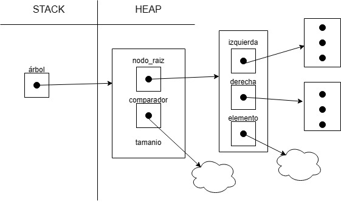
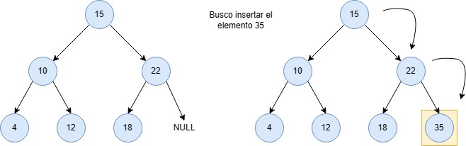
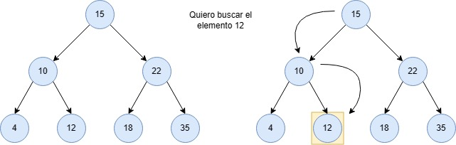
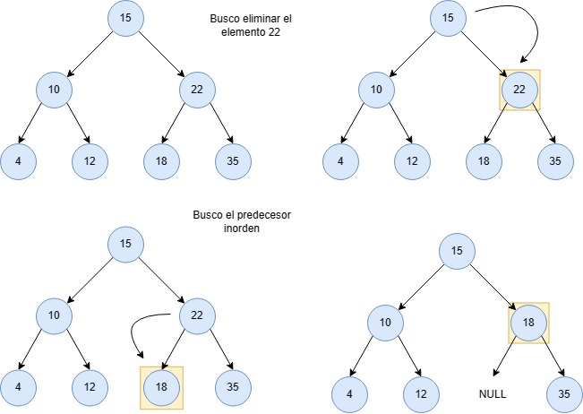
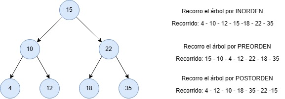
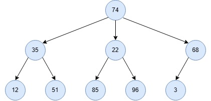
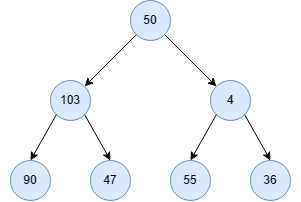
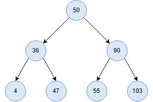

# TDA ABB

## Repositorio de Jonathan Dominguez - 110057 - chondominguez55@gmail.com

- Para compilar:

```bash
gcc -std=c99 -Wall -Wconversion -Wtype-limits -pedantic -Werror -O2 -g src/*.c pruebas_chanutron.c -o pruebas_chanutron
```

- Para ejecutar:

```bash
./pruebas_chanutron
```

- Para ejecutar con valgrind:
```bash
valgrind --leak-check=full --track-origins=yes --show-reachable=yes --error-exitcode=2 --show-leak-kinds=all --trace-children=yes ./pruebas_chanutron
```
---
##  Funcionamiento

<br>A continuación voy a explicar las funciones más importantes de ABB.

Pero primero, el diagrama de memoria:

<div align="center">

</div>

<br>Función `abb_insertar`

Esta función inserta un elemento en la posición correcta del árbol. 
La misma llama una función recursiva, `abb_insertar_rec`, que es la encargada de buscar el lugar donde insertar.
Usa un comparador que le indica si tiene que insertarse en la rama derecha o izquierda. Así recursivamente, hasta encontrar un lugar NULL a insertarse.

- Si el árbol está vacío, al **nodo_raiz** se le asigna el **nuevo nodo** que contiene el elemento. 
- El otro caso, es que el árbol ya contiene aunque sea un elemento, y se usa el comparador que le indica de que lado insertar.


En caso de error se retorna **NULL**.

**La complejidad de esta función es O(log(n))**
<br>Pero se tiene que tener en cuenta el peor de los casos, que és cuando el árbol degenera en lista. Y tiene que recorrer hasta el final de esa lista. Por lo cual, 
**la complejidad de esta función sería O(n)**.

<div align="center">

</div>

<br>Función `abb_buscar`

Esta función busca un elemento en el árbol, si es que existe. 
La misma llama una función recursiva, `abb_buscar_rec`, que es la encargada de buscar el elemento.
La función mencionada, usa la misma metodología que la de `abb_insertar_rec`. Qué usa un comparador, que le indica hacía donde ir. Así recursivamente, hasta encontrar el elemento o no. Si se encuentra, se lo devuelve.

En caso de error o de no encontrar el elemento, se retorna **NULL**.

**La complejidad de esta función es O(log(n))**.
<br>Como mencionamos antes, siempre se tiene que tener en cuenta el peor de los casos entonces, **la complejidad de esta función sería O(n)**.

<div align="center">

</div>

<br>Función `abb_quitar`

Esta función elimina un elemento del árbol, si es que existe. 
La misma llama una función recursiva, `abb_quitar_rec`, que es la encargada de eliminar el elemento.
Esta, usa el comparador, como las anteriores. Para eliminar el elemento hay que tener en cuenta 3 posibles casos.

- Si el nodo del elemento a borrar, no tiene hijos. Se elimina sin problemas.
- Si tiene un hijo, el hijo pasa a estar en el lugar del elemento a borrar.
- Si tiene dos hijos, este es el caso más complicado. Acá usamos la función `predecesor_inorden_rec` que recibe el hijo izquierdo del elemento a borrar y busca el nodo que está más a la derecha de todo. Basícamente vamos bajando por la rama derecha de cada nodo que haya. Para que luego, ese nodo pase a estar en el lugar del que queremos eliminar.

En caso de error o de no encontrar el elemento a borrar, se retorna **NULL**.

**La complejidad de esta función es O(log(n))**.
<br>Como ya comenté, hay que saber que existe el peor de los casos, por lo cual, 
**la complejidad de esta función sería O(n)**.

<div align="center">

</div>

<br>Función `abb_con_cada_elemento`

Esta función recorrer el árbol de 3 posibles formas que voy a explicar a continuación y le aplica una función booleana a cada elemento.
En este caso solo vamos a usar estos tipos de recorridos.

- `recorrer_por_preorden_rec`: Recorre el árbol de forma PREORDEN. En simples palabras, primero aplica la función al elemento que visita. Luego va hacia el hijo izquierdo, hace lo mismo que arriba. Y en caso de que no haya otro hijo izquierdo, va por el derecho. Así sucesivamente.
- `recorrer_por_inorden_rec`: Recorre el árbol de forma INORDEN. Primero va hacia el hijo izquierdo, qué esté más a la izquierda. Una vez que ya no haya más hijos izquierdos, le aplica la función a ese elemento. Luego le aplica la función al elemento de su padre, para luego ir hacia la hijo derecho en busca del más izquierdo. Para aplicar la misma lógica.
- `recorrer_por_postorden_rec`: Recorre el árbol de forma POSTORDEN. Bajamos por la rama de los hijos izquierdos. Una vez que encontremos que ya no haya hijo izquierdo, miramos la rama derecha. Aplicando la misma idea que arriba. Una vez hecho esto, vamos a encontrar un nodo que no tiene hijos. A ese mismo le aplicamos la función. Luego volvemos al hijo padre, para ir a su rama derecha. Así recursivamente, le aplicamos la función a los hijos y al final al padre.


En caso de error, retorna 0.
<br>**La complejidad de esta función es O(log(n))**.
<br>Pero como ya mencionamos, **la complejidad de esta función sería O(n)**.

<div align="center">

</div>

Este es un ejemplo de como se recorreria el árbol

## Respuestas a las preguntas teóricas

<br>**Punto 1**

<br>Un árbol es una estructura de datos que esta formada por uno o más nodos, que estan conectados. El nodo principal se llama "raíz" y los sucesores "hijos". Cada nodo puede tener cero o más hijos. 

<div align="center">

</div>
En este caso es un árbol donde la raíz tiene 3 hijos.

<br>Por otro lado, un árbol binario es un tipo de árbol en el que cada nodo tiene un máximo de dos hijos, llamados "hijo izquierdo" y "hijo derecho".

<div align="center">

</div>

Primitivas

1) Buscar: Al no tener un orden en el árbol, la complejidad es O(n).
2) Insertar: La complejidad es O(n).
3) Eliminar: La complejidad es O(n).
4) Destruir: La complejidad es O(n).

<br>Un árbol binario de busqueda es un tipo de árbol binario. La única diferencia es que está ordenado y que se cumple la propiedad de que el valor de cada nodo es mayor que el de su hijo izquierdo y menor que el de su hijo derecho.

<div align="center">

</div>

Primitivas

1) Buscar: Al tener el árbol ordenado, la complejidad en el mejor de los casos es O(log(n)).
2) Insertar: La complejidad en el mejor de los casos es O(log(n)).
3) Eliminar: La complejidad en el mejor de los casos es O(log(n)).
4) Destruir: La complejidad es O(n).

<br>**Punto 2**

En mi implementación, utilizo principalmente funciones recursivas, ya que esto me permite simplificar y hacer más legible el código. Además, el uso recursivo me facilita la identificación de problemas.

Otra ventaja de utilizar funciones recursivas es que puedo modularizar los procesos, lo que hace que el código sea más fácil de entender.

<br>Por ejemplo, en la función `abb_buscar`.

La idea principal consiste en comparar el elemento buscado con el elemento actual y, en función del resultado, continuar la búsqueda en la rama izquierda o derecha del árbol.

Si el elemento buscado es menor que el elemento actual, se sigue buscando en la rama izquierda del árbol. Si, por el contrario, el elemento buscado es mayor que el elemento actual, se busca en la rama derecha del árbol. Este proceso se repite de forma recursiva hasta encontrar el elemento buscado o llegar a un nodo vacío, en cuyo caso se devuelve **NULL**.

Este tipo de ideas que se pueden plantear de forma iterativa, como tambien de forma recursiva. Y en mi opinión, es mejor de esta forma.

<br>Otro ejemplo, en la función `abb_destruir`.

La estrategia utilizada consiste en recorrer el árbol en **POSTORDEN**, es decir, visitar primero los hijos izquierdos, luego los hijos derechos y finalmente el nodo padre.

Al recorrer el árbol en **POSTORDEN**, se garantiza que cada nodo hijo ha sido destruido antes de destruir el nodo padre. Esto es importante para evitar problemas de memoria y asegurar que no queden nodos sin liberar.

Esta implementación recursiva es muy conveniente, ya que permite llamar a la misma de forma recursiva para destruir los hijos izquierdos y derechos antes del nodo padre.