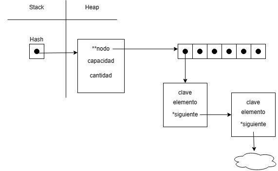
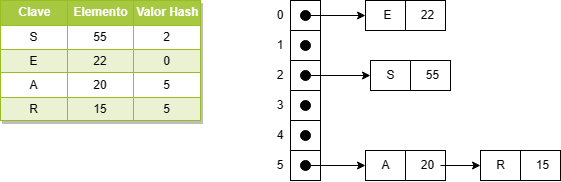
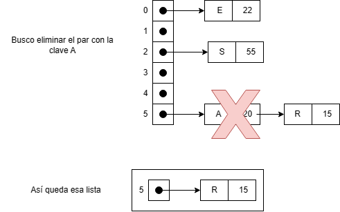
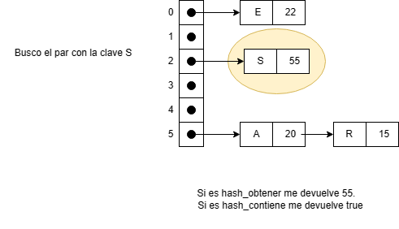
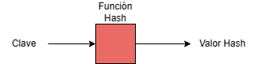
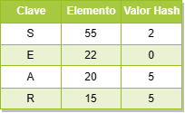

# TDA HASH

## Repositorio de Jonathan Dominguez - 110057 - chondominguez55@gmail.com

- Para compilar:

```bash
gcc -std=c99 -Wall -Wconversion -Wtype-limits -pedantic -Werror -O2 -g src/*.c pruebas_chanutron.c -o pruebas_chanutron
```

- Para ejecutar:

```bash
./pruebas_chanutron
```

- Para ejecutar con valgrind:
```bash
valgrind --leak-check=full --track-origins=yes --show-reachable=yes --error-exitcode=2 --show-leak-kinds=all --trace-children=yes ./pruebas_chanutron
```
---
##  Funcionamiento

<br>A continuación voy a explicar las funciones más importantes de Hash.

Pero primero, el diagrama de memoria:

<div align="center">

</div>

<br>Función `hashear`

Esta función utiliza el algoritmo de hash conocido como DBJ2 el cual recibe una clave por parametro y devuelve su valor hash.

La complejidad de `hashear` es **O(1)**. 

<br>Función `rehashear`

Esta función crea un nuevo hash con el doble de capacidad que el anterior. Y se le insertan todos los pares del hash viejo a este mismo. Para luego liberar la memoria del anterior. 

En caso de error se retorna **NULL**.

La complejidad de esta función es **O(n)**.

<br>Función `hash_insertar`

Como su nombre lo indica inserta un par en el hash. Dependiendo de la situación pueden ocurrir 4 casos:

1) Lugar libre: En este caso, una vez usada la función `hashear` y obtenida la posición de nuestro hash. Nos encontramos en la situación que ese lugar esta vacío. Por lo tanto, insertamos directamente. La complejidad de esta función es **O(1)**.

2) Colision: Como nuestra función `hashear` nos puede devolver el mismo número para distintas claves, vamos a tener algo llamado colisión. A simples cuentas, se trabaja con una lista enlazada en la posicion del hash que nos devolvió. El siguiente al par que está ahí va a ser el que voy a insertar. Esto genera que sea **O(n)** pero es necesario ya que no pueden haber claves repetidas y tengo que verificar que la clave que voy a insertar no lo sea. Para ello, hago mención abajo.

3) Clave repetida: Si insertamos un par con una clave igual a una ya existente, vamos a tener que actualizar el elemento del par que ya existia con este nuevo elemento. La complejidad de esta función para este caso es **O(1)**. Ya que tendríamos que ir a esa posición y actualizarlo. Pero si hay colisión, la complejidad es **O(n)**.

4) Factor de carga excedido: El factor de carga no es más que un número que nos indica si estamos bien o si necesitamos `rehashear`. Esto es importante, porque trabajamos con una capacidad máxima definida y no deberíamos de excederla o por menos no exceder el factor de carga. Una vez excedido ese factor, vamos a `rehashear` toda nuestra tabla de hash. Haciendo así que nuestra tabla pueda tener más capacidad. La complejidad de este caso es totalmente dependiente de la función `rehashear` que mencionamos arriba.

En caso de error se retorna **NULL**.

La complejidad de `hash_insertar` en caso de que no haya colisión es **O(1)** mientras qué si la hubiese sería **O(n)**.

<div align="center">

</div>

<br>Función `hash_quitar`

Quita un par con la clave que le pasan por parámetro. Vamos a la posición correspondiente y en caso de que sea **NULL**, se retorna **NULL**. Si no es **NULL** pero tampoco es la clave que ingresé, tengo que recorrer la lista enlazada. Si se encuentra, se retorna el elemento borrado sino **NULL**.

La complejidad de `hash_quitar` si no hay colisión es **O(1)**. En caso de que la haya es probable que sea **O(n)**.

<div align="center">

</div>

<br>Función `hash_obtener` o `hash_contiene`

La idea de estas funciones es la misma. La de `hash_obtener` es retornar el elemento que contiene el par con la clave pasada por parametro. Mientras que `hash_contiene`, retorna true o false si es que existe un par con esa clave.
Vamos a la posición, y si no está en esa posición se retorna el caso correspondiente o se recorre la lista enlazada si es que hay.

En caso de error se retorna **NULL** o **false**. Dependiendo del caso.

La complejidad de `hash_obtener` y `hash_contiene` si no hay colisión es **O(1)**. En caso de que la haya es probable que sea **O(n)**.

<div align="center">

</div>

<br>Función `hash_hash_con_cada_clave`

Esta función recorre el hash por orden de posición. Primero va hacia la primera posición y recorre la lista en enlazada que hay alli. Una vez que recorrió toda la lista enlazada, pasa a la siguiente posición. Sumado a que a cada elemento se le aplica una función y se cuenta las veces que fue invocada. Si esa misma retorna false, se corta la iteración. Y se retorna la cantidad de veces que fue invocada la función.

En caso de error se retorna **0**.

La complejidad de esta función es **O(n)**.

## Respuestas a las preguntas teóricas

<br>**Punto 1**

Un diccionario es una colección de pares clave-valor, donde cada clave es única y se utiliza para acceder o establecer el valor asociado a ella.
Básicamente la clave del diccionario funciona como un índice.
Esto es muy útil ya que nos genera un mejor performance a la hora de acceder a los datos.

<br>**Punto 2**

Una función hash es una función que recibe una clave y devuelve un número entero llamado "hash code". Para que esta función sea eficiente se necesita que para cada clave recibida devuelva un valor hash adecuado. A lo que me refiero con adecuado es que ese valor devuelto no genere colisión con otro valor hash. O por lo menos, que haya la menor cantidad de colisiones posibles.

<div align="center">

</div>

<br>**Punto 3**

Una tabla hash es una estructura de datos que utiliza la función hash para "mapear" las claves en posiciones determinadas. Consiste de un array que puede contener los pares clave-valor.

<div align="center">

</div>

Los diferentes métodos de resolución de colisiones vistos son:

1 - Encadenamiento: Consiste en que cada posición de la tabla hash tiene una lista enlazada de elementos. Básicamente, cuando se genera una colisión de claves el elemento que se quería insertar se agrega a esa lista enlazada. Una de las ventajas es que no se utiliza espacio de la tabla, pero su contraparte es que a la hora de hacer una busqueda o insertar tenga que recorrer esa lista enlazada.

2 - Probing: Cuando se produce una colisión, se busca la siguiente posición libre. Hay distintos tipos de probing, como el "lineal" que busca el siguiente espacio libre inmediato. O también el "cuadrático" que se busca la siguiente posicion libre utilizando una función cuadrática.
El probing es muy bueno para evitar colisiones pero genera problemas de rendimiento si la tabla está por llenarse.

3 - Zona de desborde: Se reserva una zona de desborde en la tabla para almacenar los elementos que producen colisiones. Esto evita el uso de recorrer una lista enlazada o buscar posiciones libres. Pero puede reducir la eficacia de la busqueda y aumentar la complejidad de su implementación. 
