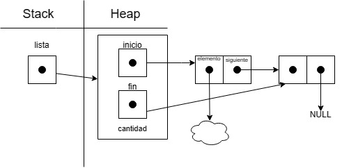
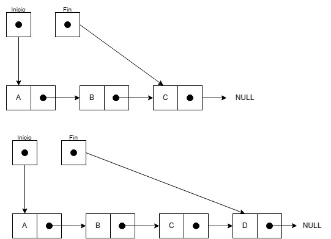
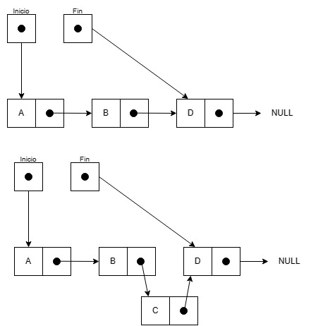
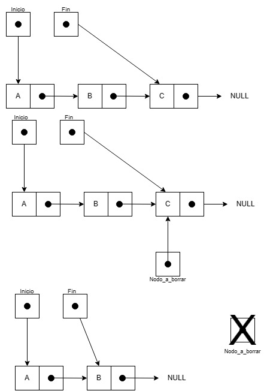
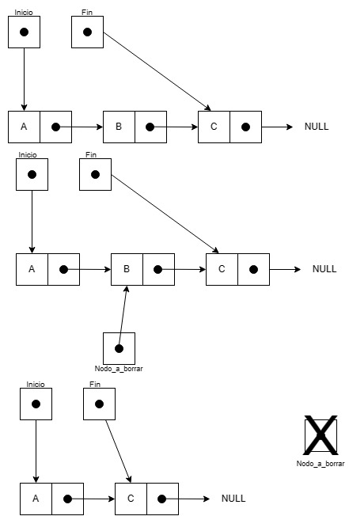
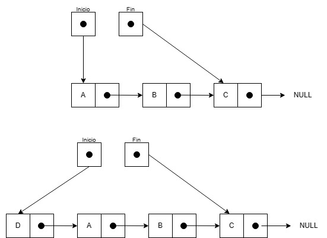
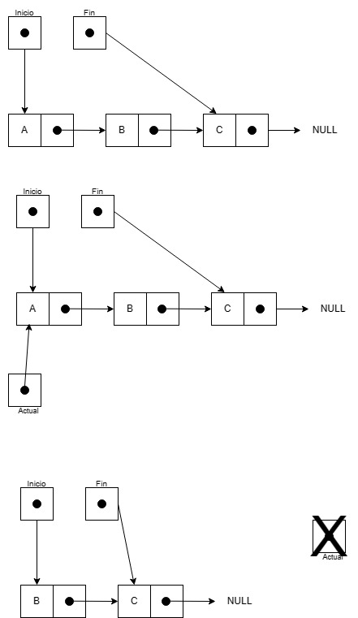

<div align="right">

</div>

# TDA-LISTA

## Repositorio de Jonathan Dominguez - 110057 - chondominguez55@gmail.com

- Para compilar:

```bash
gcc -std=c99 -Wall -Wconversion -Wtype-limits -pedantic -Werror -O2 -g src/*.c pruebas_chanutron.c -o pruebas_chanutron
```

- Para ejecutar:

```bash
./pruebas_chanutron
```

- Para ejecutar con valgrind:
```bash
valgrind --leak-check=full --track-origins=yes --show-reachable=yes --error-exitcode=2 --show-leak-kinds=all --trace-children=yes ./pruebas_chanutron
```
---
##  Funcionamiento

<br>A continuación voy a explicar las funciones más importantes de  lista.

Pero primero, el diagrama de memoria:

<div align="center">

</div>

<br>Función `lista_insertar`

La misma inserta un elemento al final de la lista. Se plantean dos posibles casos, el caso de que la lista este vacía y el que no. 

- Si la lista está vacía, al **inicio** se le asigna el **nuevo nodo** que contiene el elemento. 

- El otro caso, es que la lista ya contiene aunque sea un elemento, el **siguiente** al **fin** va a ser mi **nuevo nodo**. Y como mi **nuevo nodo** va a ser el nuevo final, el **siguiente** a mi nodo va a ser **NULL**. Debido a que es el indicador de que es el último elemento de la lista.

Por último, le asigno al **nuevo fin** el **nuevo nodo** y se aumenta en uno la cantidad de elementos.

Está claro avisar, que en caso de error se retorna **NULL** o **false** (según el caso).

**La complejidad de esta función es O(1)**

<div align="center">

</div>

<br>Función `lista_insertar_en_posicion`

Es similar a la anterior función, solo que con un pequeño detalle. Yo decido donde insertar. En este caso tenemos 3 situaciones que se pueden plantear, la primera es que querramos insertar al **inicio**, la segunda es insertar al **final** o que ingresemos una **posición inexistente**, y la tercera ya sería insertar en el **medio**. 

- El primer caso se soluciona indicando que el **siguiente** a mi **nuevo nodo** es el **inicio** de la lista. Y el nuevo **inicio** de la lista va a ser mi **nuevo nodo**.

- El segundo, se plantea de que si se recibe una **posicion mayor o igual** al tamaño de la lista, puedo llamar a la función `lista_insertar` para que haga el trabajo. Dado que, esa se inserta al final (que es lo que buscamos).
- Y el tercero y último, es si queremos insertar en cualquier otra **posición válida**. 

Necesitamos recorrer la lista, hasta encontrar la **posición anterior** para que podemos hacer el intercambio de referencias sin perder alguna.

Una vez que se recorrió la lista mediante un **nodo actual** que pasa al **siguiente** constantemente hasta encontrar la posición mencionada. **Nodo actual** va a estar parado en el **anterior** a la posición pasada por parámetro, por eso recorremos hasta la **posición anterior**, y el **siguente** a mi **actual** es el que esta en la posición elegida. Se indica que el **siguiente** a mi **nuevo nodo** va a ser el **siguiente** a mi **actual** (ya que vamos a insertar el elemento entre el **actual** y el **siguiente** al **actual**).

Por lo tanto, el **nuevo siguiente** del **actual** va a ser mi **nodo nuevo** y se aumenta en uno la cantidad de elementos.

**La complejidad de esta función es O(n)**. Que ese sería el peor de los casos, y es el tercero. 

Si fuese el primero o el segundo, **la complejidad de esta función es O(1)**

<div align="center">

</div>

<br>Función `lista_quitar`

Como su nombre lo indica, esta función elimina elementos de la lista. El objetivo de la misma es sacar el elemento del final.

La idea es recorrer la lista, hasta encontrar el final. Vamos a necesitar un **nodo actual** y un **nodo anterior**. El **nodo a borrar** va a ser el **actual** cuando llegue al final y el **anterior** va a ser mi **nuevo fin**, y el **siguiente** a mi **anterior** va a ser **NULL** que ya indique porque se hacía.

- Hay un caso particular, que es si la lista tiene solo un elemento. Que simplemente como no sé recorrió aún, **actual** va a estar en **inicio** y eliminó ese mismo. Una vez eso, se disminuye en uno la cantidad de elementos.

**La complejidad de esta función es O(n)**

<div align="center">

</div>

<br>Función `lista_quitar_de_posicion`

Ya sabemos que hace, vamos a explicar como funciona. Partimos de 3 posibles casos:

- Que la posición ingresada sea **mayor o igual** a la última o que la lista tenga un solo elemento. Por lo cual, podemos trabajarla por la función `lista_quitar`. Si la posición es inexistente la idea es igual a la de `lista_insertar_en_posicion`, solo que en vez de insertar al final, elimino.

- El segundo caso, dice de si se quiere sacar en la **posición inicial**. Por lo tanto, hay que proponer una idea similar  a la función `lista_insertar`. Se usa un nodo llamado **nodo a quitar** que guarda el **inicio** y que mi **nuevo inicio** va a ser el **siguiente** al que quiero quitar.

- El último, le toca recorrer la lista hasta el anterior a eliminar. Como hicimos en `lista_quitar`. Dicho así rápido, el **nodo a quitar** va a ser el **siguiente** al **actual** y el **nuevo siguiente** al **actual** va a ser el **siguiente** de mi **nodo a quitar**. Una vez eso, se disminuye en uno la cantidad de elementos.

**La complejidad de esta función es O(n)**. Que ese sería el peor de los casos, y son el primero y el tercero. 

Si fuese el segundo, **la complejidad de esta función es O(1)**

<div align="center">

</div>

<br>Función `lista_elemento_en_posicion`

Esta función devuelve el elemento en la **posición pasada**, si es que la misma existe.

Hay dos situaciones: 

- La primera es que la **posición** sea la última, y retorno el elemento final de la lista.
- Y la segunda es tener que recorrer la lista para devolver dicho elemento.

Es redundante especificar la **posición inicial** o **final**, puesto que ambas hacen referencia a los extremos de la lista.

**La complejidad de esta función es O(n)**. Que ese sería el peor de los casos, y es el segundo. 

Si fuese el primero, **la complejidad de esta función es O(1)**

<br>Función `lista_buscar_elemento`

La idea de este método es buscar en la lista si existe el **elemento pasado por parámetro**. A su vez, para agilizar las cosas se recibe una función que compara.
Ergo, mientras voy avanzando en la lista **voy aplicando este función a cada elemento** que le paso. Hasta que se encuentre el buscado y se lo devuelve.

**La complejidad de esta función es O(n)**


## Respuestas a las preguntas teóricas

<br>**Punto 1**

<br>Tanto cola y pila, son tipos de listas. Solo que su funcionalidad es otra. Tienen restricciones a la hora de insertar y quitar.

La función de insertar, en cola se llama **encolar** y en pila se llama **apilar**

Y la otra operación que es quitar, en cola es **desencolar** y en pila es **desapilar**

Una de las diferencias importantes es que yo puedo recorrer la lista y puedo quitar un elemento cuando quiero. Cosa que en cola y pila no puedo.

Cola se usa con la finalidad de FIFO, First In First Out.

Mientras que Pila, con LIFO, Last In First Out.

Vamos a comparar `lista_insertar` - `cola_encolar` - `pila_apilar`

<br> `lista_insertar` como ya habiamos dicho inserta un elemento al final, de esta forma:

<div align="center">

</div>

<br> `cola_encolar` se comporta de la misma forma que lista_insertar. 

<br> `pila_apilar` es diferente en esa parte e inserta al inicio. Haciendolo de esta forma.

<div align="center">

</div>

Haciendo así que el último elemento insertado, pueda después sacarlo de forma O(1). Como voy a explicar en la otra función.

Estas 3 operaciones mencionadas, son todas de complejidad O(1).

<br> Ahora vamos a comparar `lista_quitar` - `cola_desencolar` - `pila_desapilar`

<br> `lista_quitar` comenté que eliminaba un elemento del final, pero esta operación siempre es O(n). Ya que necesito del nodo anterior.

<div align="center">

</div>

<br> `cola_desencolar` elimina el primer elemento de la lista, por justamente FIFO. 

<div align="center">

</div>

<br> `pila_desapilar` a su vez, desapilar tiene el mismo diagrama, ya que el último que agregué está en la primera posición. 

Como podemos ver, `lista_quitar` es O(n) mientras que `cola_desencolar` y `pila_desapilar` son O(1).

<br>**Punto 2**	

<br>**Lista simplemente enlazada**

- Insertar	
	1. Al inicio, es una operación de complejidad O(1).
	2. Al final, también es O(1).
	3. Al medio, ya es O(n) porque tengo que recorrer hasta esa posición.

- Obtener
	1. Al inicio, es  O(1).
	2. Al final, es O(1).
	3. Al medio, es O(n) porque tengo que recorrer hasta esa posición.
	
- Eliminar
	1. Al inicio, es  O(1).
	2. Al final, es O(n) porque tengo que recorrer hasta el anterior, para poder marcarlo como el nuevo último.
	3. Al medio, es O(n) porque tengo que recorrer hasta esa posición.
	
<br>**Lista doblemente enlazada**

- Insertar
	1. Al inicio, es O(1).
	2. Al final, es O(1).
	3. Al medio, es O(n) porque tengo que recorrer hasta esa posición.

- Obtener
	1. Al inicio, es  O(1).
	2. Al final, es O(1).
	3. Al medio, es O(n) porque tengo que recorrer hasta esa posición.
	
- Eliminar
	1. Al inicio, es  O(1).
	2. Al final, es O(1) porque el final tiene la referencia al anterior.
	3. Al medio, es O(n) porque tengo que recorrer hasta esa posición.

<br>**Vector dinámico**

Con el vector dinámico ya empiezan los problemas de la **memoria contigua**. Tengo que hacer **realloc** por cada operación.  
Las complejidades O(1) son sin contar el peor caso del **realoc**, o sea que las trabajo por la operación en sí.

- Insertar
	1. Al inicio, es O(n) porque primero tengo que aumentar el tamaño del vector y segundo, tengo que desplazar a todos los elementos un lugar hacia la derecha.
	2. Al final, es O(1) sin contar que tengo que expandir el vector.
	3. Al medio, es O(n) porque tengo que recorrer hasta esa posición y hacer lo mencionado en el caso 1.

- Obtener
	1. Al inicio, es  O(1).
	2. Al final, es O(1).
	3. Al medio, es O(n) porque tengo que recorrer hasta esa posición.
	
- Eliminar
	1. Al inicio, es  O(n), al ser memoria contigua tengo que desplazar todos elementos hacia la izquierda, haciendo que el segundo pise al primero. Para luego disminuir el espacio en memoria.
	2. Al final, es O(1).
	3. Al medio, es O(n) porque tengo que recorrer hasta esa posición y hacer lo mencionado en el caso 1.
	
<br>**Punto 3**

<br>Cola complejidades

Función `cola_encolar`

Es O(1), porque inserto el elemento al final.

Función `cola_desencolar`

Es O(1), porque elimino el elemento al inicio.

<br>Pila complejidades

Función `pila_apilar`

Es O(1), porque inserto el elemento al inicio.

Función `pila_desapilar`

Es O(1), porque elimino el elemento al inicio.


