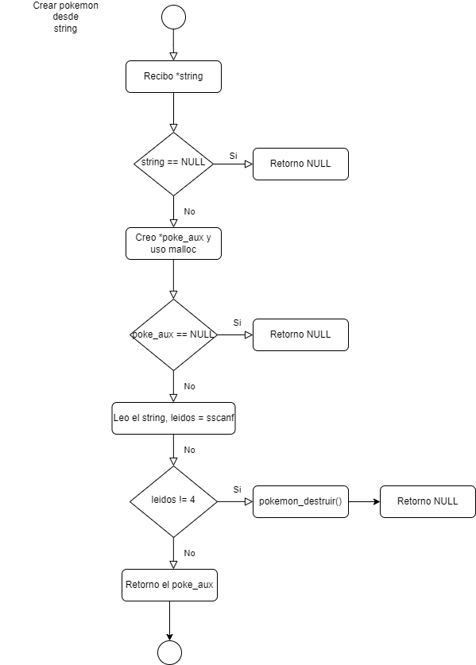
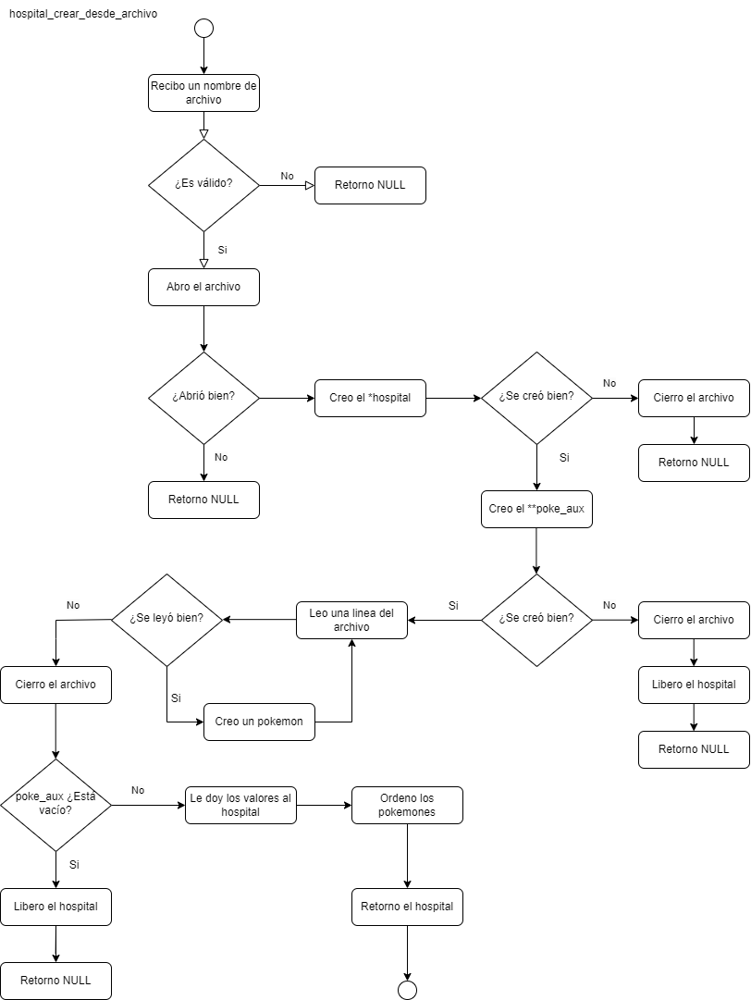

<div align="right">

</div>

# TP1

## Repositorio de Jonathan Dominguez - 110057 - chondominguez55@gmail.com

- Para compilar:

```bash
gcc -std=c99 -Wall -Wconversion -Wtype-limits -pedantic -Werror -O2 -g src/*.c pruebas_chanutron.c -o pruebas_chanutron
```

- Para ejecutar:

```bash
./pruebas_chanutron
```

- Para ejecutar con valgrind:
```bash
valgrind --leak-check=full --track-origins=yes --show-reachable=yes --error-exitcode=2 --show-leak-kinds=all --trace-children=yes ./pruebas_chanutron
```
---
##  Funcionamiento

En el archivo `tp1.c` la función `hospital_crear_desde_archivo` utiliza `fgets` y `realloc`.

```c
	while (fila != NULL) {
		poke_aux =
			realloc(poke_aux, (tamanio + 1) * sizeof(pokemon_t *));
		if (!poke_aux) {
			hospital_destruir(hospital);
			fclose(archivo_pokemones);
			return NULL;
		}
		poke_aux[tamanio] = pokemon_crear_desde_string(linea);
		tamanio++;
		fila = fgets(linea, MAX_LINEA, archivo_pokemones);
	}
```
Con `fgets` estoy leyendo una linea donde su maximo de caracteres va a ser 30 en este caso, determinado por la constante `MAX_LINEA`.
Una vez que por llamarlo así existe la linea, uso el `realloc` para aumentarla en uno. Llegado el caso de que sea todo correcto, se lo asigno al hospital en el siguiente código.
Y luego, en base voy creando el pokemon con la funcion `pokemon_crear_desde_string`, la asigno a mi variable auxiliar. Y despues para asignar el siguiente pokemon, necesito más memoria.

```c
hospital->pokemones = poke_aux;
```
Acá estoy asignando la nueva direccion de memoria para mi hospital. Ya que es una direccion válida donde voy a tener todos los pokemones.

En el archivo `tp1.c` la función `*hospital_aceptar_emergencias` utiliza `realloc` en una varia auxiliar para dar el tamaño correspondiente en base voy agregando pokemones.

```c
size_t total = cant_pokes_ambulancia + hospital->cantidad_pokemon;

	pokemon_t **poke_aux =
		realloc(hospital->pokemones, total * sizeof(pokemon_t *));
```
Este caso el idéntico al de arriba, solo que en vez de crearlos. Ya existen y solo los añado. Yo parto de una cantidad inicial de pokemones y tengo que agregar los nuevos. 
Ergo, voy a tener más que antes. El planteo sobre porque trabajar sobre un auxiliar es el mismo caso.

Una vez que ya expandi de forma correcta la memoria y se la asigne al hospital. Puedo empezar a agregarlos de forma NO ORDENADA. Ya que luego los ordeno mediante la funcion `ordenar_pokemones_por_salud`
Lo que hace este for es, partiendo desde la ultima posicion de `hospital->pokemones`, le asigno la primera de `pokemones_ambulancia`, hasta el final del vector a añadir.
```c
size_t j = 0;
	for (size_t i = hospital->cantidad_pokemon; i < total; i++) {
		hospital->pokemones[i] = pokemones_ambulancia[j];
		j++;
	}
```

## Mis diagramas
<div align="center">

</div>

<div align="center">

</div>

<div align="center">

</div>
